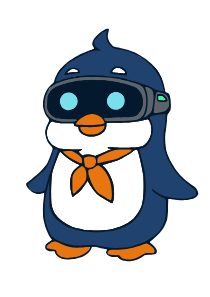
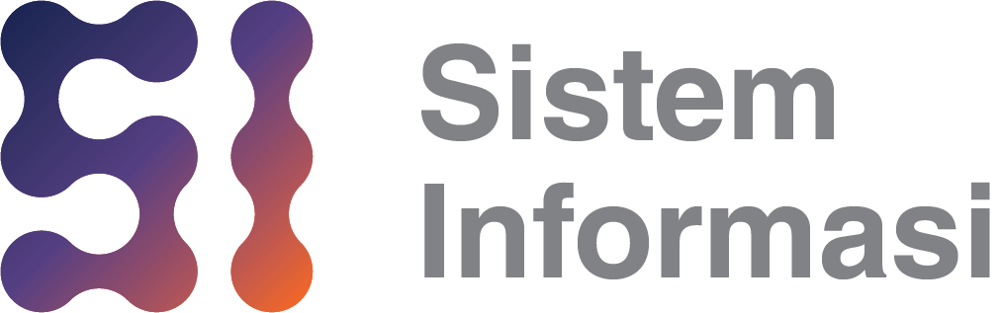

<div align="center">



# 🐧 ESI Booth Showcase

### Website interaktif untuk booth Program Studi Sistem Informasi UPH

*Kenalan dengan Sistem Informasi lewat cara yang tidak biasa — pakai tangan, suara, gerakan badan, dan kamera.*

<br />

[](https://www.instagram.com/callencode/)
[](https://www.uph.edu/)
[](https://www.instagram.com/sisteminformasi.uph/)

<br />


</div>

---

## 📖 Tentang proyek ini

Kalau kamu berdiri di depan booth jurusan dan ada orang membagikan brosur, kamu
mungkin mengambilnya, melipatnya, lalu melupakannya. Website ini dibuat untuk
menjawab masalah itu.

**ESI Booth Showcase** adalah website interaktif yang dipasang di laptop atau layar
booth Program Studi **Sistem Informasi**, Fakultas *Artificial Intelligence and
Data Sciences* (**FAIDAS**), **Universitas Pelita Harapan**. Alih-alih membaca
brosur, pengunjung diajak **bermain dulu** — melambaikan tangan di depan kamera,
berteriak ke mikrofon, menirukan gaya konyol dengan seluruh badan, lalu berfoto
bersama maskot.

Semua permainannya sengaja dibangun dari keterampilan yang memang dipelajari di
Sistem Informasi: pelacakan tangan dan pose, pemrosesan sinyal suara, desain
interaksi, dan pengembangan aplikasi web. Jadi begitu ada yang bertanya *"ini
dibuat pakai apa?"*, jawabannya sekaligus jadi jawaban *"jadi Sistem Informasi
itu belajar apa?"*.

Yang memandu sepanjang halaman adalah **ESI** 🐧 — maskot penguin berhelm VR dan
bersyal oranye, yang juga bisa diajak ngobrol.

<div align="center">
<br />
<b>🎯 Tujuannya sederhana: bikin orang berhenti, mencoba, tertawa, lalu bertanya.</b>
<br /><br />
</div>

---

## ✨ Isi website

<table>
<tr>
<td width="50%" valign="top">

### 💬 Ngobrol dengan ESI
Tanya langsung soal Sistem Informasi — apa yang dipelajari, prospek kerjanya,
dan tiga peminatan yang bisa dipilih. **Dwibahasa** (Indonesia/Inggris) dan bisa
membacakan jawabannya dengan suara. Klik maskot di hero, ESI langsung menyapa.

</td>
<td width="50%" valign="top">

### 🎮 ESI Data Rush
Tangkap data yang berjatuhan dari awan. Bisa dimainkan pakai keyboard, **atau
kendalikan ESI dengan tangan di depan kamera** dan "jepit" jari untuk mengambil
disketnya. Tiga level, makin cepat.

</td>
</tr>
<tr>
<td width="50%" valign="top">

### 🖐️ Air Spelling
Huruf melayang di udara — eja kata istilah Sistem Informasi dengan **menjepit
huruf yang benar** satu per satu. Masih bisa dimainkan pakai keyboard biasa.

</td>
<td width="50%" valign="top">

### 🎤 ESI Sound Rocket
**Suaramu adalah bahan bakar jetpack.** Makin keras berteriak, makin tinggi dan
jauh ESI terbang. Langitnya tak berbatas — satu-satunya bahaya adalah jatuh ke
tanah.

</td>
</tr>
<tr>
<td width="50%" valign="top">

### 🕺 ESI Pose Party
ESI memperagakan gaya konyol, kamu menirukannya dengan **seluruh badan**. Layar
mengubahmu jadi penguin lengkap dengan rangka badan yang ikut bergerak.

</td>
<td width="50%" valign="top">

### 📸 ESI Photo Booth
Tiga jepretan, tiga gaya, satu **strip polaroid** siap posting. Ada efek jejak
gerak, kerlip, dan konfeti — plus mode foto rame-rame.

</td>
</tr>
<tr>
<td width="50%" valign="top">

### 🧠 Kuis Sistem Informasi
Lima pertanyaan ringan untuk menguji apa yang baru saja dipelajari pengunjung.

</td>
<td width="50%" valign="top">

### 🏆 Papan Skor Booth
Skor semua permainan tersimpan di perangkat, jadi pengunjung bisa saling
menyalip sepanjang hari.

</td>
</tr>
</table>

---

## 🎓 Tiga peminatan Sistem Informasi UPH

| | Peminatan | Fokus | Halaman resmi |
|:--:|---|---|:--:|
| 📊 | **Data Science & Analytics** | Mengubah data jadi keputusan — machine learning, analitik prediktif, visualisasi data | [Lihat →](https://www.uph.edu/program/data-science-and-data-analytics) |
| 🕹️ | **Interactive Intelligence Systems** | Membangun pengalaman yang disukai pengguna — UI/UX lanjut, aplikasi interaktif, AR/VR | [Lihat →](https://www.uph.edu/program/interactive-intelligence-systems/) |
| 💡 | **Digital Technology and Innovation** | Menciptakan produk digital — IoT, aplikasi mobile, strategi bisnis, manajemen proyek | [Lihat →](https://www.uph.edu/program/digital-technology-and-innovation/) |

---

## 🚀 Cara menjalankan

> [!IMPORTANT]
> Kamera dan mikrofon **hanya diizinkan browser di halaman yang aman**. Klik ganda
> file `index.html` (`file://`) tidak akan bisa mengakses kamera, dan foto tidak
> bisa diekspor. Jalankan lewat `localhost` atau HTTPS.

<details open>
<summary><b>Pilihan 1 — XAMPP (paling praktis untuk booth)</b></summary>

<br />

1. Salin seluruh folder ini ke `C:\xampp\htdocs\esi\`
2. Nyalakan **Apache** dari XAMPP Control Panel
3. Buka `http://localhost/esi/` di **Chrome** atau **Edge**

</details>

<details>
<summary><b>Pilihan 2 — GitHub Pages (otomatis HTTPS)</b></summary>

<br />

1. Unggah `index.html` dan folder `assets/` ke repositori
2. **Settings → Pages → Source: `main` / root**
3. Buka `https://username.github.io/nama-repo/`

Semua fitur kamera, mikrofon, dan ekspor foto berfungsi karena GitHub Pages
sudah HTTPS. Kalau memakai domain sendiri, pastikan **Enforce HTTPS** menyala.

</details>

<details>
<summary><b>Pilihan 3 — server statis apa pun</b></summary>

<br />

```bash
python3 -m http.server 8000
# lalu buka http://localhost:8000
```

</details>

### 💡 Tips untuk hari-H

- **Gunakan Chrome atau Edge.** Suara ESI dan dialog "Save As" untuk foto paling
  baik di sana.
- **Perhatikan pencahayaan.** Hindari jendela atau lampu terang tepat di
  *belakang* pemain — cahaya dari depan jauh lebih stabil untuk pelacakan.
- **Beri ruang ±2 meter** di depan kamera supaya kedua lengan masuk frame untuk
  Pose Party.
- **WiFi booth tidak bisa diandalkan?** File pelacakan bisa di-host sendiri —
  caranya ada di [catatan teknis](TECHNICAL.md).
- **Reset papan skor**: klik dua kali judul papan skor mana pun.

---

## 🧩 Teknologi

| Bagian | Yang dipakai |
|---|---|
| Struktur | HTML, CSS, dan JavaScript murni — **tanpa framework, tanpa proses build** |
| Grafik permainan | Canvas 2D API |
| Pelacakan tangan & badan | MediaPipe Tasks Vision (*Hand Landmarker* & *Pose Landmarker*) |
| Deteksi suara | Web Audio API (`AnalyserNode`, pengukuran RMS) |
| Suara ESI | Web Speech API (`speechSynthesis`) |
| Ekspor foto | Canvas `toDataURL` + File System Access API |
| Penyimpanan skor | `localStorage` |

Seluruh website ada dalam **satu file `index.html`** beserta folder `assets/`.
Tidak ada `npm install`, tidak ada dependensi yang perlu dipasang — cukup taruh
di server statis mana pun.

---

## ♿ Dirancang supaya tidak mudah gagal

Booth itu tempat yang keras: WiFi putus, laptop tanpa GPU bagus, ruangan berisik,
pengunjung yang tidak mau menunggu. Karena itu setiap fitur punya jalan
cadangan:

- Semua permainan kamera **tetap bisa dimainkan dengan keyboard, mouse, atau sentuh**
- Pelacakan tangan gagal dimuat → otomatis turun ke **mode gerak sederhana** yang jalan tanpa internet
- Mikrofon diblokir → tombol **Space** menggantikan suara
- Pelacakan badan gagal → Photo Booth tetap jalan, hanya propertinya yang mati
- Mikrofon **mengukur kebisingan ruangan otomatis**, jadi tetap adil di booth yang ramai
- Navigasi punya penanda posisi dan menu lipat untuk layar sempit

---

## 📄 Dokumentasi lain

- **[TECHNICAL.md](TECHNICAL.md)** — catatan implementasi, keputusan desain,
  hasil pengujian, cara meng-host file MediaPipe sendiri, dan cara mengubah isi
  jawaban ESI, gaya foto, atau tingkat kesulitan tiap permainan.

---

<div align="center">

## 👩‍💻 Author

**Dibuat oleh [@callencode](https://www.instagram.com/callencode/)**

[](https://www.instagram.com/callencode/)

<br />

<sub>Untuk Program Studi Sistem Informasi<br />
Fakultas Artificial Intelligence and Data Sciences (FAIDAS)<br />
Universitas Pelita Harapan</sub>

<br />

<sub>Maskot ESI, logo Sistem Informasi, dan logo UPH × FAIDAS adalah milik<br />
Universitas Pelita Harapan dan dipakai untuk keperluan promosi program studi.</sub>

<br /><br />

**⭐ Kalau ini berguna, jangan lupa mampir ke [@sisteminformasi.uph](https://www.instagram.com/sisteminformasi.uph/)**

<br />



</div>
